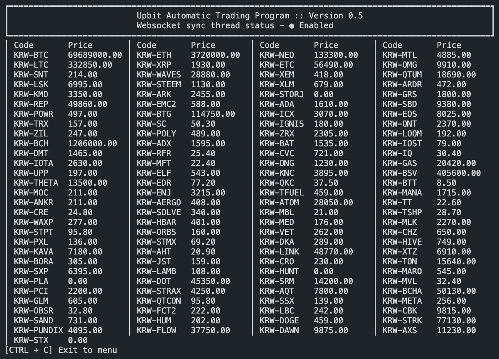
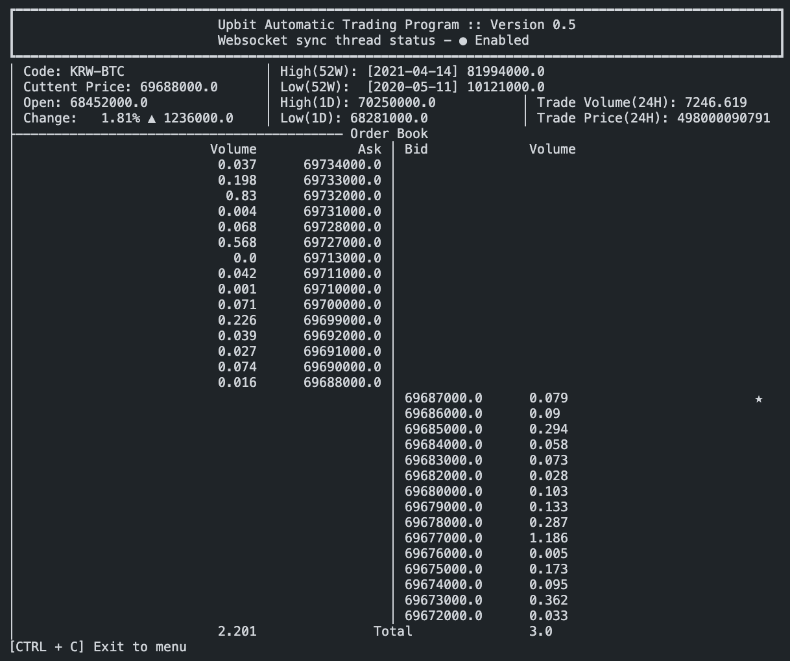
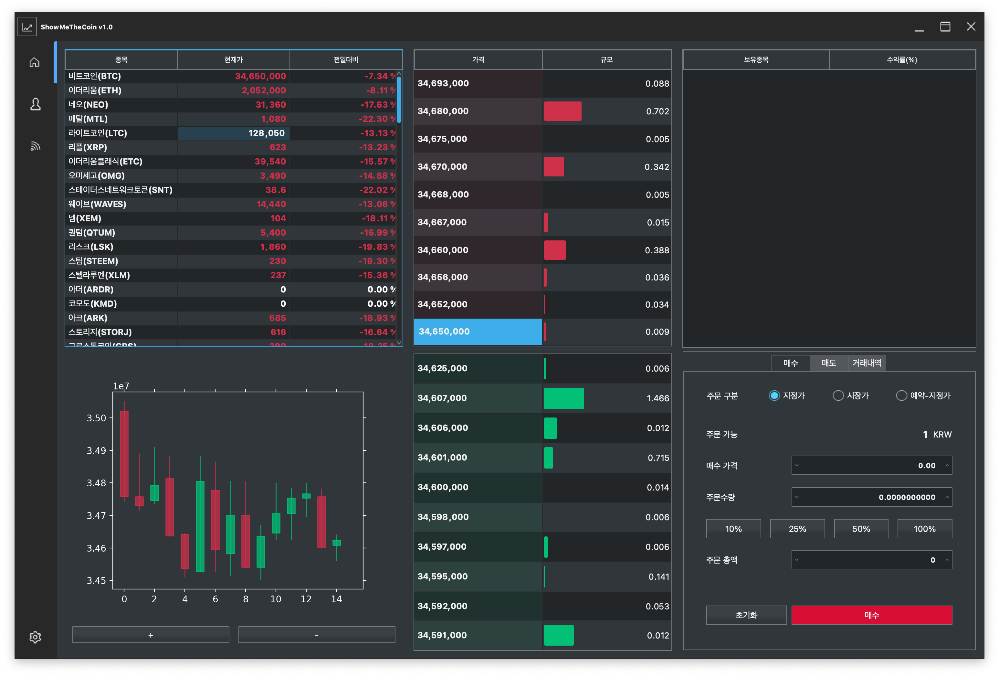
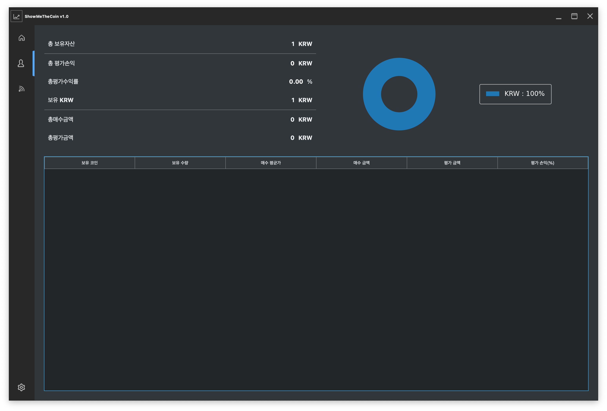

<p align="center">
 <h2 align="center">Upbit Automatic Trader</h2>
 <p align="center">Automatic trader program base on upbit openAPI wrapping by pyupbit package</p>
  <p align="center">
    <a href="https://github.com/showmethecoin/upbit-trader/issues">
      
    </a>
    <a href="https://github.com/showmethecoin/upbit-trader/pulls">
      
    </a>
  </p>
  <p align="center">
    <a href="https://github.com/showmethecoin/upbit-trader/issues/new/choose">Report Bug</a>
    ·
    <a href="https://github.com/showmethecoin/upbit-trader/issues/new/choose">Request Feature</a>
  </p>
  <p align="center">
    <a href="https://docs.upbit.com/">Upbit Developer Center</a>
    ·
    <a href="https://github.com/sharebook-kr/pyupbit">Pyupbit Github</a>
  </p>
</p>

CLI Total price|CLI Individual price
:-------------------------:|:-------------------------:
|
GUI Main|GUI Own list
|

# Index

- [Index](#index)
  - [0. Environment](#0-environment)
  - [1. Quick Start](#1-quick-start)
    - [a. Clone project](#a-clone-project)
    - [b. Copy config example to config](#b-copy-config-example-to-config)
    - [c. Edit config](#c-edit-config)
    - [d. Install python module](#d-install-python-module)
    - [e. Run code](#e-run-code)
  - [2. Build package](#2-build-package)
    - [a. Windows](#a-windows)
    - [b. Linux & Mac](#b-linux--mac)
  - [3. Rule (PEP8)](#3-rule-pep8)
    - [a. 코드 레이아웃](#a-코드-레이아웃)
    - [b. 명명 규칙](#b-명명-규칙)
    - [c. 문장과 표현식](#c-문장과-표현식)
  - [Contributor](#contributor)

## 0. Environment

- Operating System
  - Linux: x86 (32-bit), x86_64, ARMv7 (32-bit), ARMv8 (64-bit)
  - Windows: x86, x86_64
  - macOS: x86_64
- Dependencies
  - Python versions: 3.7-3.9

## 1. Quick Start

### a. Clone project

``` sh
git clone https://github.com/showmethecoin/upbit-trader
```

### b. Copy config example to config

``` sh
cd upbit-trader
cp config.yaml.example src/config.yaml
```

### c. Edit config

``` yaml
# config.yaml.example 
# Unnecessary edit
LOG:
  FORMAT: '[%(asctime)s.%(msecs)03d: %(levelname).1s %(filename)s:%(lineno)s] %(message)s'
  PATH: upbit-trader.log
  PRINT: BOOLEAN_PRINT_LOG # True/False
  SAVE: BOOLEAN_SAVE_LOG # True/False
# Necessary edit
MONGO:
  ID: MONGO_ACCOUNT_ID
  IP: MONGO_IP
  PASSWORD: MONGO_ACCOUNT_PASSWORD
  PORT: MONGO_PORT
UPBIT:
  ACCESS_KEY: INPUT_YOUR_UPBIT_ACCESS_KEY
  SECRET_KEY: INPUT_YOUR_UPBIT_SECRET_KEY
STRATEGY:
  TYPE: STRATEGY_TYPE # VolatilityBreakout/VariousIndicator
  MAX_INDIVIDUAL_TRADE_PRICE: FIAT_WON # 5000<WON
PROGRAM:
  GUI: BOOLEAN_USE_GUI # True/False
```

### d. Install python module

``` sh
pip install -r requirements.txt
```

### e. Run code

``` sh
cd src
python main.py
```

## 2. Build package

### a. Windows

It must build successfully

``` sh
cd src
python setup.py bdist_msi
```

### b. Linux & Mac

It must build successfully but it cannot run normally

``` sh
cd src
python setup.py bdist_app
```

## 3. Rule ([PEP8](http://pythonstudy.xyz/python/article/511-%ED%8C%8C%EC%9D%B4%EC%8D%AC-%EC%BD%94%EB%94%A9-%EC%8A%A4%ED%83%80%EC%9D%BC))

### a. 코드 레이아웃

- 들여쓰기를 할 때 Tab 대신 공백(Space)을 사용한다. 특히 Python 3는 Tab과 공백을 혼용해서 사용하는 것을 허용하지 않는다. 단 VSCode에서의 Tab은 공백 4개로 대체됨
- 문법적으로 들여쓰기를 할 때는 4개의 공백을 사용한다
- 각 라인은 79자 이하로 한다. 라인이 길어서 다음 라인으로 넘어갈 때는 원래 들여쓰기 자리에서 4개 공백을 더 들여쓴다
- 함수나 클래스는 2개의 공백 라인을 추가하여 구분한다. 메서드는 한 개의 공백 라인으로 구분한다
- import는 (여러 모듈을 콤마로 연결하지 말고) 한 라인에 하나의 모듈을 import한다

  ```python
  No:
  import os, sys

  Yes:
  import os
  import sys
  ```

- 컬렉션 인덱스나 함수 호출, 함수 파라미터 등에서 불필요한 공백을 넣지 않는다

  ```python
  No:
  spam( ham[ 1 ], { eggs: 2 } )
  bar = (0, )
  spam (1)

  Yes:
  spam(ham[1], {eggs: 2})
  bar = (0,)
  spam(1)
  ```

- 변수 할당시 할당자 앞뒤로 하나의 공백만 넣는다

  ```python
  No: i=i+1

  Yes: i = i + 1
  ```

### b. 명명 규칙

- 함수, 변수, Attribute는 소문자로 단어 간은 밑줄(_)을 사용하여 연결한다<br>`예: total_numbers`
- 클래스는 단어 첫 문자마다 대문자를 써서 연결하는 CapWords 포맷으로 명명한다<br>`예: CoreClass`
- 모듈명은 짧게 소문자로 사용하며 밑줄을 쓸 수 있다. 패키지명 역시 짧게 소문자를 사용하지만 밑줄은 사용하지 않는다<br>`예: serial_reader`
- 모듈 상수는 모두 대문자를 사용하고 단어마다 밑줄로 연결하는 ALL_CAPS 포맷으로 명명한다<br>`예: MAX_COUNT = 100`
- 클래스의 public attribute는 밑줄로 시작하지 말아야 한다<br>`예: name`
- 클래스의 protected instance attribute는 하나의 밑줄로 시작한다<br>`예: _initialized`
- 클래스의 private instance attribute는 2개의 밑줄로 시작한다<br>`예: __private_var`
- 인스턴스 메서드는 (객체 자신을 가리키기 위해) self 를 사용한다<br>`예: def copy(self, other):`
- 클래스 메서드는 (클래스 자신을 가리키기 위해) cls 를 사용한다<br>`예: def clone(cls, other):`

### c. 문장과 표현식

- if, for, while 블럭 문장을 한 라인으로 작성하지 말 것<br>여러 라인에 걸쳐 사용하는 것이 더 명료함

  ```python
  No:
  if a < 0: a = 0

  Yes:
  if a < 0:
      a = 0
  ```

- a는 b가 아니다를 표현할 때 a is not b 를 사용한다<br>not a is b 를 사용하지 말 것

  ```python
  No: if not a is b

  Yes: if a is not b
  ```

- 값이 비어있는지 아닌지를 검사하기 위해 길이를 체크하는 방식을 사용하지 말 것<br>대신 if mylist 와 같이 표현함

  ```python
  No: if len(mylist) == 0
  Yes: if not mylist

  No: if len(mylist) > 0
  Yes: if mylist
  ```

- import 문은 항상 파일의 상단에 위치하며, 표준 라이브러리 모듈, 3rd Party 모듈, 그리고 자신의 모듈 순으로 import 한다

  ```python
  import os
  import numpy
  import mypkg
  ```

- 모듈 import시 절대 경로를 사용할 것을 권장한다<br>예를 들어, sibling 모듈이 현재 모듈과 같은 폴더에 있더라도 패키지명부터 절대 경로를 사용함<br>단, 복잡한 패키지 경로를 갖는 경우 상대경로(.)를 사용할 수 있다

  ```python
  No:
  import sibling

  Yes:
  import mypkg.sibling
  from mypkg import sibling
  from . import sibling # 상대경로
  from .sibling import example
  ```

## Contributor

- [codejune](https://github.com/codejune)
- [zerohoon96](https://github.com/zerohoon96)
- [chanyangyu](https://github.com/ChanYangYu)
- [kimjeus](https://github.com/kimjeus)
- [kimuihyeon222](https://github.com/kimuihyeon222)
